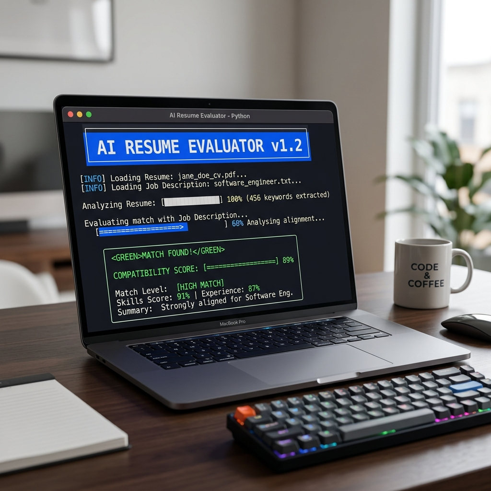

# 🚀 AI Resume Evaluator CLI



A professional, Python-based Command Line Interface (CLI) tool designed to analyze your resume against specific job descriptions. Leveraging **TF-IDF text analysis** and **skill-matching algorithms**, this tool provides actionable feedback to help you optimize your resume for applicant tracking systems (ATS) and human recruiters.

---

## ✨ Key Features

- **📂 Automatic Resume Detection**: Effortlessly scans the current directory for PDF files. No need to type long file paths.
- **🔍 Intelligent Job Search**: Interactive search functionality to find matching job positions from a built-in dataset.
- **📊 Robust Scoring System**:
  - **TF-IDF Weighting**: Evaluates the relevance of your resume content against job responsibilities.
  - **Skill Matching**: Specifically checks for required technical and soft skills.
- **💡 Actionable Insights**: Provides specific recommendations on missing keywords, thin content, and terminology refinement.
- **🎨 Rich Terminal UI**: Uses the `rich` library to deliver a beautiful, color-coded, and progress-aware user experience.

---

## 🛠️ Installation

### Prerequisites
- **Python 3.8+**
- **pip** (Python package installer)

### Setup

1. **Clone the repository**:
   ```bash
   git clone https://github.com/Sidharth-Prabhu/Resume-Evaluator.git
   cd Resume-Evaluator
   ```

2. **Create a virtual environment** (recommended):
   ```bash
   python -m venv .venv
   source .venv/bin/activate  # On Windows: .venv\Scripts\activate
   ```

3. **Install dependencies**:
   ```bash
   pip install -r requirements.txt
   ```

---

## 🚀 Usage

1. **Place your Resume**: Ensure your resume is in **PDF format** and located in the project root directory.
2. **Run the Evaluator**:
   ```bash
   python main.py
   ```
3. **Follow the Interactive Prompts**:
   - Confirm the detected resume.
   - Search for the job position you are targeting (e.g., "Software Engineer", "Data Analyst").
   - Review your **Compatibility Score** and detailed **Analysis Report**.

---

## 🧠 How It Works (Technical Details)

The evaluation engine uses a multi-factor scoring approach:

| Factor | Weight | Description |
| :--- | :--- | :--- |
| **Skill Match** | 60% | Direct keyword matching against `skills_required` in the job dataset. |
| **TF-IDF Alignment** | 40% | Token-frequency analysis comparing resume text to job descriptions/responsibilities. |

### The Scoring Algorithm
The final score is normalized and weighted to provide a realistic "match" percentage. It penalizes thin resumes and rewards the use of industry-specific terminology found in the target job's responsibilities.

---

## 📂 Project Structure

- `main.py`: The core application logic and CLI interface.
- `resume_data.csv`: The dataset containing job positions and their requirements.
- `requirements.txt`: List of necessary Python libraries.
- `assets/`: Contains project visuals and documentation assets.

---

## 🔧 Troubleshooting

- **"Failed to extract text from the resume"**: Ensure your PDF is text-based and not a scanned image. If it's a scan, use an OCR tool before evaluating.
- **"No job positions found"**: Verify that `resume_data.csv` is present in the root directory and contains valid data.
- **BOM Errors**: The script automatically handles UTF-8-SIG encoding to prevent Byte Order Mark issues when reading CSV data.

---

## 🤝 Contributing

Contributions are welcome! Please feel free to submit a Pull Request or open an issue for any bugs or feature requests.

---

## 📝 License

This project is licensed under the MIT License - see the [LICENSE](LICENSE) file for details.
